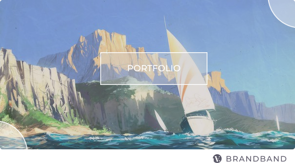

    

&nbsp;

  **Lorem** ipsum dolor sit amet, consectetur adipiscing elit, sed do eiusmod tempor incididunt ut labore et dolore magna aliqua. Ut enim ad minim veniam, quis nostrud exercitation ullamco laboris nisi ut aliquip ex ea commodo consequat. Duis aute irure dolor in reprehenderit  

### [Smart Car Accident Report App](https://github.com/hadabr/smart-car-accident-report-app) [repo]

  
  
**Toolset**: Photoshop + React Native + ExpressJS   
> Lorem ipsum dolor sit amet, consectetur adipiscing elit, sed do eiusmod tempor incididunt ut labore et dolore magna aliqua. Ut enim ad minim veniam, quis nostrud exercitation ullamco laboris nisi ut aliquip ex ea commodo consequat. Duis aute irure dolor in reprehenderit  

  

  
 <b>Preview</b> ⇲

      

  

### [Dyatlov Pass Story](https://github.com/hadabr/dyatlov-pass-tour) [repo] 

   
      
**Toolset**: Photoshop + React + VibrantJS  
> Lorem ipsum dolor sit amet, consectetur adipiscing elit, sed do eiusmod tempor incididunt ut labore et dolore magna aliqua. Ut enim ad minim veniam, quis nostrud exercitation ullamco laboris nisi ut aliquip ex ea commodo consequat. Duis aute irure dolor in reprehenderit  

  

  
 <b>Preview</b> ⇲

      

  

### [Linstrider tarot oracle](https://github.com/hadabr/linstrider-tarot-oracle) [repo] 

   
      
**Toolset**: Photoshop + pure JS + SASS  
> Lorem ipsum dolor sit amet, consectetur adipiscing elit, sed do eiusmod tempor incididunt ut labore et dolore magna aliqua. Ut enim ad minim veniam, quis nostrud exercitation ullamco laboris nisi ut aliquip ex ea commodo consequat. Duis aute irure dolor in reprehenderit  

  

  
 <b>Preview</b> ⇲

      

  

